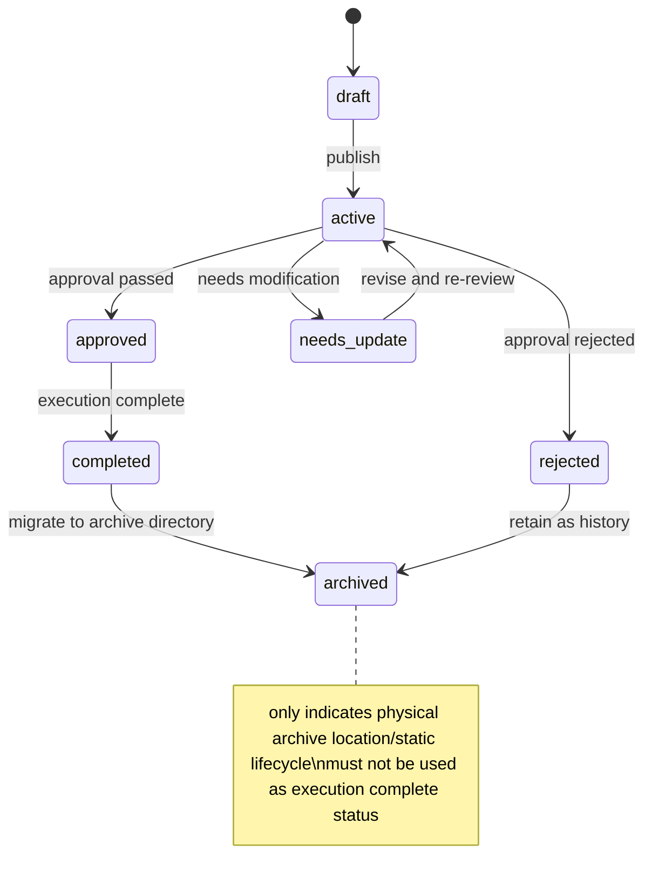
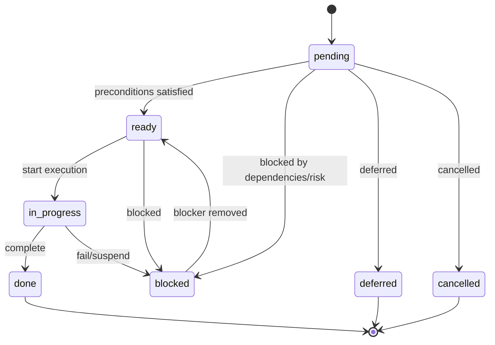
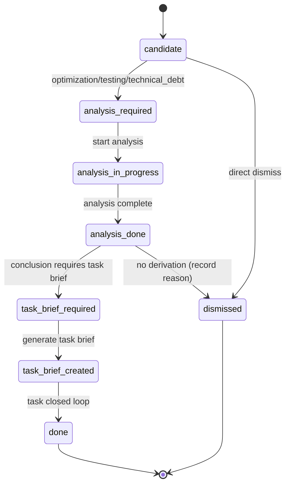

# Controlled Enumerations

This document centrally defines enumeration values usable in ALDS documents, task briefs, work orders, project pulse, and review records. Document record values must use English enumerations defined here; user-facing confirmation prompts should use user's language.

## 1. Approval Conclusions

| Recorded Value | Meaning                                |
| :------------- | :------------------------------------- |
| `approved`     | Agree to proceed to next step          |
| `rejected`     | Disagree to continue                   |
| `needs_update` | Need adjustment before re-confirmation |

Applicable to:

- Task brief approval
- Work order approval
- Write plan approval
- Verification and audit results approval
- Project pulse approval

## 2. Document Status

| Recorded Value | Meaning |
| :--- | :--- |
| `draft` | Draft |
| `active` | Currently active |
| `approved` | Approved |
| `rejected` | Rejected |
| `needs_update` | Needs update |
| `completed` | Completed |
| `archived` | Archived (only for physical archive location or document's own static lifecycle, must not be used as execution complete status) |
| `implemented` | Analysis report identified items all established task briefs/technical debt/rejected (task brief completion independent; applies to analysis reports) |

## 3. Execution Status

| Recorded Value | Meaning |
| :--- | :--- |
| `pending` | Not started |
| `ready` | Preconditions satisfied, can start |
| `blocked` | Blocked by dependencies, risks, or pending confirmations |
| `in_progress` | Executing |
| `done` | Completed |
| `deferred` | Deferred |
| `cancelled` | Cancelled |

> **Execution complete uniformly uses `done`**. `archived` belongs to §2 document status only, must not be used as execution complete status. Consistent with `alds_standards.md` §18.

## 4. Task Types

| Recorded Value | Meaning |
| :--- | :--- |
| `feature` | Feature development |
| `optimization` | Optimization |
| `bugfix` | Bug fix |
| `refactor` | Refactoring |
| `change_request` | Change request |
| `governance` | Governance or process change |
| `documentation` | Documentation task |
| `technical_debt` | Technical debt |
| `testing` | Testing and verification |
| `review` | Review |

## 5. Priorities

| Recorded Value | Meaning |
| :--- | :--- |
| `critical` | Must prioritize |
| `high` | High priority |
| `medium` | Medium priority |
| `low` | Low priority |

## 6. Risk Levels

| Recorded Value | Meaning |
| :--- | :--- |
| `critical` | Critical risk |
| `high` | High risk |
| `medium` | Medium risk |
| `low` | Low risk |
| `unknown` | Insufficient info, cannot judge |

### 6.1 Risk Quantification Criteria

Risk level determines task path (simple/engineering), verification coverage level, and upgrade approvals. Must judge per following objective criteria, not by subjective impression alone. Multiple tiers hit take highest; Agent self-assessment conflicts with objective criteria take higher tier and record reason.

| Level | Auto-Trigger Conditions (any hit = not below this tier) |
| :--- | :--- |
| `critical` | Touches funds/billing/transaction consistency; touches data persistence & crash recovery; touches multi-replica consistency/consensus; touches any `.AI/project/invariants/` item; touches any `.AI/project/guards/` item |
| `high` | Changes public API/protocol/schema; changes auth/authorization/credentials; changes ≥3 modules or crosses service boundaries; concurrency/transaction/cache logic; adds external dependencies |
| `medium` | Single module core logic; changes ≥1 persistence field; affects ≥2 verification matrix dimensions |
| `low` | Purely isolated, single-point, with sufficient automated test coverage changes |
| `unknown` | Insufficient info to apply any above, must supplement basis before continuing |

> `critical` and `high` tasks must not take simple task path (simple task requires risk ≤ `medium`, see `start.md` §6.1).

## 7. Effort Estimation

| Field | Recommended Recorded Values |
| :--- | :--- |
| `estimated_code_size` | `none`, `small`, `medium`, `large`, `unknown`, or explicit line range |
| `estimated_effort` | Work hours or days, e.g., `4h`, `2d`, `unknown` |

Effort estimates must remain estimates, must not be written as verified facts.

## 8. Project Pulse Derivation Status

Project pulse "Other Task Ledger" candidates use following derivation statuses, judged per `.AI/process/project_pulse/task_brief_derivation.md`.

| Recorded Value | Meaning |
| :--- | :--- |
| `candidate` | Candidate, not yet decided if analysis needed |
| `analysis_required` | Must generate analysis report first |
| `analysis_in_progress` | Analysis report in progress |
| `analysis_done` | Analysis report complete, awaiting derivation decision |
| `task_brief_required` | Analysis conclusion requires task brief generation |
| `task_brief_created` | Formal task brief generated |
| `dismissed` | Rejected or no longer needed after analysis |
| `done` | Completed |

## 9. Review Feedback Disposition Conclusions

In review feedback adoption process, each feedback item disposition uses following enumerations.

| Recorded Value | Meaning |
| :--- | :--- |
| `adopt_now` | Adopt immediately |
| `adopt_with_conditions` | Conditional adoption |
| `defer` | Defer |
| `reject` | Reject adoption |

## 10. Review Conclusions

Architecture review, spec review, etc. review process final conclusions use following enumerations.

| Recorded Value | Meaning |
| :--- | :--- |
| `approved` | Review passed |
| `rejected` | Review failed |
| `needs_update` | Needs update then re-review |

## 11. Instance Fact Source Status

`.AI/project/project.yaml` instance fact source status uses following enumerations.

| Recorded Value | Meaning |
| :--- | :--- |
| `absent` | File does not exist |
| `empty_or_incomplete` | File exists but empty or incomplete |
| `initialized` | File exists and initialization complete |

## 12. Governance Mode

`.AI/project/project.yaml` `governance.governance_mode` field retains `full` (default).

| Recorded Value | Meaning |
| :--- | :--- |
| `full` | Full ALDS governance (default). Complete approval gates, independent task brief and work order, complete status sync, full-dimensional verification matrix. |

> `minimal` mode removed. Task weight no longer determined by project-level `governance_mode`, but by `start.md` §6.1 task path judgment (simple task/engineering task), see §13.

## 13. Task Eligibility Results

Task-level eligibility review uses following enumerations, per `.AI/start.md` §6.1 task path judgment.

| Recorded Value | Meaning |
| :--- | :--- |
| `simple` | Task satisfies all simple task conditions (see `start.md` §6.1), takes simple task path (single work order) |
| `full` | Task does not satisfy simple task conditions, takes engineering task path (task brief + work order) |
| `upgrade_triggered` | Simple task execution actually exceeds boundaries (multi work orders/risk escalation/touches invariants/guards/new dependencies), upgrades to engineering task |

> Eligibility review only decides "whether task brief needed", does not change workflow routing, required documents table, or skill matching.

## 14. State Machine Diagrams

Following state machines visualize legal transitions for each enum; authoritative definitions remain §2, §3, §8 text.

### 14.1 Document Status (§2)

### 14.2 Execution Status (§3)

### 14.3 Project Pulse Derivation Status (§8)

