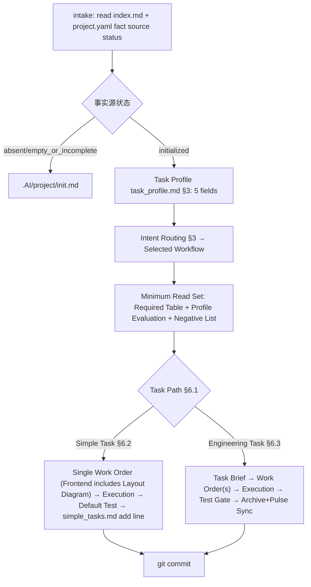

# Standard Task Flow

`.AI/start.md` is the main flow for standard tasks. Project initialization does not execute here; must route to `.AI/project/init.md`.

ALDS artifacts have two tiers: **Simple Tasks** (single work order + add one line to `reports/simple_tasks.md` after completion) and **Engineering Tasks** (task brief + work order(s)). Judgment in §6.1.

## 1. Entry Conditions

Before entering this flow, must have read:

1. `.AI/index.md`
2. Check `.AI/project/project.yaml` instance fact source status
3. If fact source status is `initialized`, read `.AI/project/project.yaml`

If fact source status is `absent` and task is ALDS standard package self-maintenance, may continue into this flow but must record "no project instance fact source, current task is standard package self-maintenance". If fact source status is `absent` and task is standard project task, or fact source status is `empty_or_incomplete`, stop this flow, route to `.AI/project/init.md` or wait for user confirmation.

If user goal is to initialize `.AI/project/` baseline, stop this flow, route to `.AI/project/init.md`.

## 2. Flow Overview

`Project Definition -> Intent Routing -> Minimum Context -> Task Path Judgment -> { Simple Task | Engineering Task } -> Execution -> Verification(default test) -> Archive -> Git Commit`

- **Simple Task**: `... -> Single Work Order -> User Instruction Execution -> Default Test -> simple_tasks.md add line -> Archive Work Order`
- **Engineering Task**: `... -> Task Brief -> Approval -> Work Order(s) -> Approval -> Execution -> Test Gate -> Archive + Pulse Sync`

### 2.1 Flow Main Diagram

Entry conditions, exit artifacts, and approval points for each step in corresponding sections (§1, §3, §5, §6, §7, §9, §10).

## 3. Intent Routing

### 3.0 Operational Intent Commands (Shortcut)

If user instruction matches operational intent vocabulary (summary / next steps·task / conclusion), it is a non-development meta-task: load `.AI/skills/operational.md`, respond per its output format. Shortcut subsequent stages of this flow—no task brief, work order, verification record, or archive commit generated unless user explicitly requests persistence. Vocabulary and format per that skill as sole basis.

| User Intent | Workflow | Required Reading |
| :--- | :--- | :--- |
| Development, implementation, fix, patch, bounded refactor, documentation implementation | `.AI/workflows/feature_development.md` | `.AI/process/audit/code_change_audit_protocol.md`, `.AI/process/review/code_review_checklist.md` |
| Performance, optimization, bottleneck, throughput, latency, memory | `.AI/workflows/performance_analysis.md` | Performance workflow declared verification and analysis docs |
| Test, verification, regression, build failure, static check alert | `.AI/workflows/unified_task_flow.md` | Unified flow continues to judge troubleshooting, fix, review, or assessment |
| Code review, review, audit existing changes | `.AI/workflows/code_review.md` | `.AI/process/review/code_review_checklist.md` |
| Adopt review feedback, handle review comments | `.AI/workflows/review_feedback_adoption.md` | `.AI/process/review/code_review_checklist.md` |
| Code quality assessment, technical debt analysis, code smell identification | `.AI/workflows/code_quality_assessment.md` | Quality assessment workflow and technical debt template |
| Architecture, specs, process, governance evolution | `.AI/workflows/architecture_evolution.md` | `.AI/process/review/architecture_review.md`, `.AI/process/review/spec_review.md` |
| Existing processes cannot safely express task | `.AI/workflows/create_workflow.md` | `.AI/standards/workflow_engine.md` |
| Cannot determine | `.AI/workflows/unified_task_flow.md` | Load final decision basis first, then route |

## 4. Final Decision Basis When Cannot Determine

When user input insufficient to judge process, must not directly implement. Read available basis in order:

1. `.AI/project/project.yaml`
2. `reports/project_pulse.md`
3. User-specified source materials, specs, review records, or reports
4. Relevant raw requirements in `.AI/source/requirements/`
5. Relevant raw designs in `.AI/source/design/`
6. Relevant supplementary materials in `.AI/source/references/`
7. Relevant architecture context in `.AI/project/architecture/`
8. Relevant specs in `.AI/project/specs/`
9. Relevant constraints in `.AI/project/guards/` and `.AI/project/invariants/`
10. `.AI/workflows/unified_task_flow.md`
11. `.AI/workflows/create_workflow.md`

If still cannot determine after reading, output pending confirmation questions and wait for explicit user direction.

## 5. Minimum Reading Rules

After selecting workflow, read in order. Each workflow's "required documents" table is the **sole authoritative basis**.

> **Priority Rule**: Once workflow selected, must use that workflow's required documents table as sole authoritative basis. Workflow engine's default load order is only for reference when creating or revising workflows; must not override selected workflow's required table at execution time.

> **Document Deduplication**: AI maintains READ_SET of already-read documents in conversation. Before loading any document, check if already read; if read, skip loading, directly reference existing conclusion. READ_SET passes whole across workflow routing, not reset.

1. `.AI/project/project.yaml` — Only when instance fact source status is `initialized`, read and bind project facts into READ_SET; standard package self-maintenance with fact source `absent` records missing and skips
2. `.AI/start.md` — Confirm flow entry, into READ_SET
3. Selected workflow document — Load per its required documents table
4. Documents not in workflow required documents table: never load

> Project facts only from `.AI/project/project.yaml` and `.AI/project/`.

> **Task Profile First**: After selecting workflow, before loading per required table, first determine five-field profile per `.AI/standards/task_profile.md` §3 (only from task description + `project.yaml`, not reading project context subdirectories), use it to evaluate required table conditional rows, and apply §5 negative list and §6 skills hit count constraints. `target_area` not directly hit `.AI/project/` subdirectories never loaded; "possibly relevant" or "just in case" not loading basis.

## 6. Task Path and Task Brief Stage

After selecting workflow and determining task profile, first judge per §6.1 whether simple task path (§6.2) or engineering task path (§6.3).

### 6.1 Task Path Judgment

All conditions below simultaneously satisfied = **Simple Task**, go §6.2; any not satisfied = §6.3 Engineering Task path:

- Not part of existing large engineering task (no existing task brief or milestone affiliation)
- Directly generated from user instruction (small optimization, fix, single-point change, doc tweak, etc.)
- Will produce only one work order
- Risk ≤ `medium`, does not touch `.AI/project/invariants/` or `.AI/project/guards/`
- No new modules or external dependencies

> Path judgment only decides "whether task brief needed", does not change workflow routing, required documents table, or skill matching.

### 6.2 Simple Task Path

Simple tasks do not generate task brief, directly generate work order:

1. Use `.AI/templates/work_order_template.md` to generate single work order; frontend tasks must include layout diagram and functional overview (see `alds_standards.md` §16.3)
2. Work order records objective, scope, verification method, risk, and pending confirmations
3. Place work order in `reports/active/plan/`
4. Stop and wait for user `approved` / `rejected` / `needs_update` (or explicit execute/modify instruction)
5. After approval execute (§8) → verify (§9, test default)
6. After completion add line at first row below header in `reports/simple_tasks.md` (newest on top), and light-archive work order to `reports/completed/plan/` (filename append `_{YYYYMMDD_HHMM}`)

Simple tasks not recorded in project pulse, no task brief generated; only ledger record is `reports/simple_tasks.md` one line. If execution actually exceeds simple task boundary (needs multiple work orders, risk escalation, touches invariants/guards, new dependencies), upgrade to engineering task: supplement task brief, completed work orders backfill as execution results.

### 6.3 Engineering Task Path (Task Brief)

Applicable conditions: does not satisfy §6.1 simple task judgment.

1. Use `.AI/templates/task_brief_template.md`
2. Task brief core records three items: **User Requirement**, **Functional Overview**, **Work Order List** (see `alds_standards.md` §15); also records objective, scope, non-goals, workflow, required reading, matched skills, deliverables, verification methods
3. Records summary, task type, priority, risk level, estimated code size, estimated effort, preconditions, and dependencies
4. If task from project pulse "other task ledger", or task type `optimization`, `testing`, `technical_debt`, judge per `.AI/process/project_pulse/task_brief_derivation.md` whether analysis report required first
5. If task affects multiple runtime conditions, data conditions, config conditions, or deliverables, plan verification matrix per `.AI/process/validation/validation_matrix.md`
6. Place task brief in `reports/active/brief/`
7. Register or update task brief entry and status in `reports/project_pulse.md`
8. Stop and wait for user `approved`, `rejected`, or `needs_update`

No work order generation or implementation before task brief gets `approved`.

Project pulse sync rules:

- Only register task briefs or candidate entries for task briefs
- Work orders only registered in owning task brief, not as project pulse independent main entries
- New task briefs added per functional task brief ledger or ad-hoc task brief ledger category
- After task completion keep entry, update execution status to `done`, append `completed` in tags column

Project pulse missing handling:

If `reports/project_pulse.md` missing:

- **Standard project task**: Prompt user project pulse missing, suggest entering `.AI/project/init.md` to complete project initialization and generate project pulse, or request user approval to create project pulse from `.AI/templates/project_pulse_template.md`. Must not skip project pulse registration step before user confirmation.
- **ALDS standard package self-maintenance task**: Allowed to continue without project pulse instance, but must explicitly record in task brief "no project pulse instance currently, this task is standard package self-maintenance". No need to sync project pulse after completion.

## 7. Work Order Stage

Applicable conditions:

- Engineering task: task brief `approved`, split into one or more work orders per objective
- Simple task: already generated single work order in §6.2, skip this stage

Execution (engineering task):

1. Use `.AI/templates/work_order_template.md`
2. Split work orders per objective, input documents, implementation scope, verification method; frontend work orders must include layout diagram and functional overview (`alds_standards.md` §16.3)
3. Record each work order's summary, status, estimated code size, estimated effort, preconditions, dependencies
4. Place work orders in `reports/active/plan/`
5. Register or update work order entries and status in owning task brief
6. **Present all work orders to user at once**, stop and wait for `approved`, `rejected`, or `needs_update`

> All work orders created and approved at once. User approves then execute per dependency order.
> Only when a work order explicitly requested for separate approval in user input, split for independent approval.

Single work order should remain atomic, verifiable, archivable. If estimated duration exceeds `5` working days, modified files exceed `10`, or net change exceeds `1000` lines, should prioritize splitting; if not splitting, must record reason.

## 8. Execution Stage

Work orders execute only after `approved`:

1. Read input documents and code context per work order
2. Implement, review, analyze, or update docs per bound workflow
3. Must not silently expand scope
4. If scope, architecture, specs, or risk changes detected, pause and return to corresponding flow (simple task over-boundary upgrades to engineering task per §6.2)
5. Record key decisions, deviations, risks
6. After each work order completion, mark work order status `done` in owning task brief §7 work order register, sync update path, estimates, actuals (simple tasks no task brief, skip)
7. Any execution failure must be handled per `.AI/process/error_handling.md` §1, no silent retry or ignore

## 9. Verification and Test Gate

After changes executed, **test is default action**:

1. AI defaults to running tests per work order verification method / verification matrix; frontend changes must include browser automation visual testing (`alds_standards.md` §21.2)
2. Execute required reviews or audits per workflow
3. If task brief or work order declares verification matrix, fill results, evidence, uncovered risks per `.AI/process/validation/validation_matrix.md`
4. Form verification and audit results
5. Stop and wait for user `approved`, `rejected`, or `needs_update`

**User Self-Test Exception**: User may explicitly declare "user will self-test and return results". AI stops, does not self-mark complete, waits for user test results (must include verification evidence) before archiving. Results without evidence not accepted.

No verification/test results (whether AI runs or user returns), must not mark complete. Frontend tasks must not substitute "manually clicked verified" for automated test evidence.

## 10. Document Update, Archive, and Commit

After verification results `approved`:

1. Update task brief, work orders, related project docs, analysis reports, or technical debt records
2. Migrate completed work orders as `{base}_{YYYYMMDD_HHMM}.md` to `reports/completed/plan/`
3. Mark work order status `done` in owning task brief (simple tasks no task brief, skip)
4. If task brief has unfinished work orders, keep in `reports/active/brief/`
5. If all work orders complete, mark task brief `completed`, migrate to `reports/completed/brief/`, sync update `reports/project_pulse.md` task brief execution status `done`, append `completed` in tags column
6. If task type `optimization`, `bugfix`, `governance`, `technical_debt`, `testing`, or `review`, add or update entry in `reports/project_pulse.md` "other task ledger"
7. If task brief sourced from analysis report (`source_analysis` field), check if all analysis report identified items implemented. If all implemented, update analysis report frontmatter `status` to `implemented`
8. Load `skills/git.md`, execute per Git operations spec
9. Check git diff, keep only task-related changes
10. Write git commit, message describes task, key changes, verification results

**Simple Task Archive**: Simple tasks no task brief, no project pulse, only ledger is add line at first row below header in `reports/simple_tasks.md` (newest on top), columns: date/summary/type/risk/net change/verification evidence/work order path; work order archived per step 2 to `reports/completed/plan/`.

## 11. Error Handling

Any stage encountering execution failure, verification failure, user rejection, AI hard block unable to continue, execute unified fallback per `.AI/process/error_handling.md`:

| Failure Type | Handling Section |
| :--- | :--- |
| Work order execution failure | §1 |
| Verification failure | §2 |
| User rejection | §3 |
| AI minimum recoverable state unable to continue | §4 |

Workflow fallbacks still per `.AI/standards/workflow_engine.md` §fallback contract; error handling is downstream fallback, does not replace workflow fallback.

## 12. Instruction Ledger

After processing a **substantive instruction**, append one line to `reports/session_log.md`, recording user input, AI response summary, and metadata. Column definitions, metadata collection commands, and write rules in `.AI/templates/session_log_template.md`.

| Column | Content |
| :--- | :--- |
| `#` | Entry sequence (auto-increment) |
| `Time` | Local time + timezone |
| `Environment` | Host·OS/kernel/arch·shell·user |
| `Model·Session` | Model·session id prefix |
| `Repo` | Branch@HEAD·dirty file count |
| `User Input` | Original or compact paraphrase |
| `AI Response` | One-line summary |
| `Artifact·Path` | Output·task path (simple/engineering) |
| `Context` | Workflow·READ_SET count·matched skills |

Rules:

- **Only substantive instructions**: Inputs driving actual work record one line; pure confirmations/clarifications/greetings ("OK", "continue", etc.) not recorded separately. Confirmation with substantive action (e.g., amend commit message) still records.
- **Newest on top**: New row inserted at first row below header (consistent with `reports/simple_tasks.md`).
- **No auto-commit**: Only append to disk, no self `git commit`; when to commit user decides.
- **No fabrication**: Time/repo state from actual command output; response summary and artifacts must trace to facts already occurred this round (consistent with `skills/operational.md` §5).
- **No secrets**: Credentials/keys must not appear in "User Input" or "AI Response" (consistent with `skills/git.md` §5).

This ledger not recorded in project pulse, not in active/completed archive flow, is long-running flat ledger file.