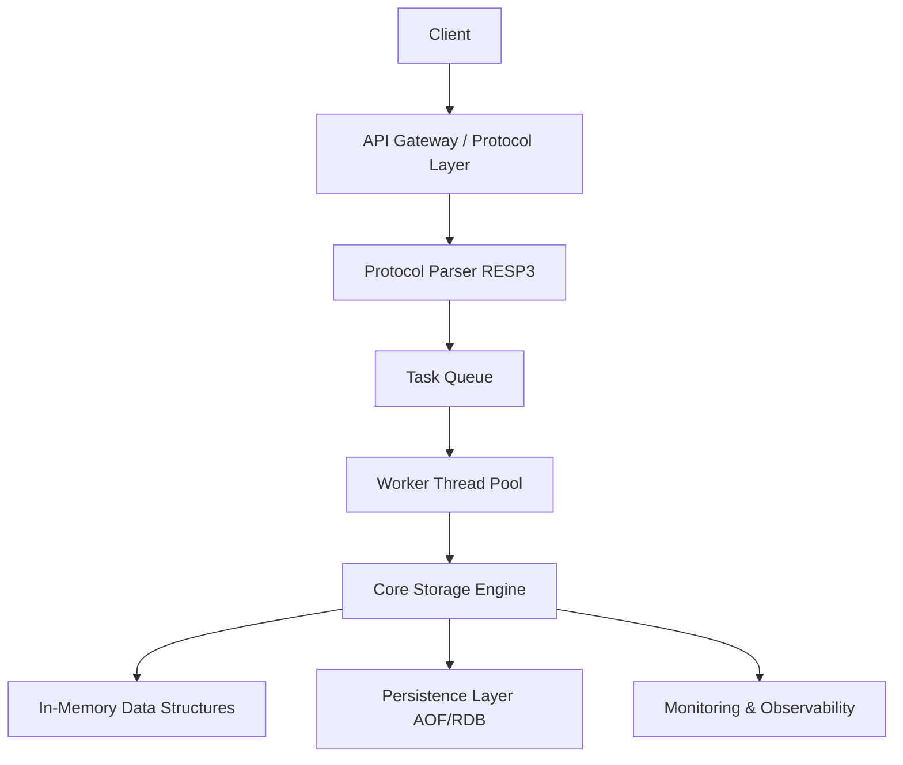

### 1. Document Metadata

- **Project Name**: [Project Name, e.g., High-Performance Distributed Cache System Redis-like Engine]
- **Document Version**: v1.0.0 (SemVer: Major.Minor.Patch)
- **Author/Designer**: [Your Name]
- **Creation Date**: 2026-06-17
- **Last Updated**: [Date]
- **Approver**: [Reviewer Names]
- **Document Status**: Draft

**Change Log**:

| Version | Date | Author | Change Summary |
|----------|------|--------|----------------|
| v1.0.0 | 2026-06-17 | [Your Name] | Initialize core architecture & storage design |
| v1.1.0 | [Date] | [Name] | [Specific change, e.g., add HA solution] |

---

### 2. Background & Goals

#### 2.1 Background
[1-2 paragraphs describing business background or current pain points. E.g.:
"Current system uses single-node in-memory DB architecture. As business scales, faces high memory fragmentation, single-thread bottleneck, insufficient multi-tenant isolation, cannot meet peak QPS and data persistence SLA requirements."]

#### 2.2 Project Goals
- **Functional Goals**:
  - Support [specific protocol, e.g., RESP3] full compat.
  - Implement core data structures [List, Hash, Sorted Set, etc.] efficient ops.
  - Support [specific features, e.g., cluster mode, multi-tenant isolation].

- **Performance Goals**:
  - QPS: Peak ≥ [number, e.g., 100,000].
  - Read/Write Latency: P99 ≤ [ms, e.g., 5ms].
  - Data Persistence: RPO ≤ [seconds], RTO ≤ [minutes].

- **Other Goals**:
  - Improve scalability, support horizontal scaling.
  - Reduce ops cost, provide comprehensive monitoring & alerting.

#### 2.3 Non-Goals
- This iteration excludes [e.g., graphical admin console, cross-DC multi-active].
- Does not support [e.g., SQL query interface, deep ORM integration], future versions.
- Not implementing [e.g., auto shard balancing, AI smart tuning].

---

### 3. High-Level Architecture Design

#### 3.1 System Architecture Diagram
[Insert architecture diagram description or placeholder, e.g., PlantUML, Draw.io, or Mermaid]



#### 3.2 Module Responsibilities
- **Protocol Parser**: Network I/O, protocol decode/encode, zero-copy tech.
- **Core Engine**: Business logic, command execution, data structure ops.
- **Storage Layer**: Memory organization + persistence mechanisms.
- **Auxiliary Modules**: Config management, monitoring instrumentation, cluster communication.
- **Boundary Definition**: Modules communicate via explicit interfaces, no direct internal state access.

#### 3.3 Design Principles
- Simplicity first: Reject over-engineering, prefer hand-written efficient code over complex frameworks.
- Zero-copy & memory-friendly: Minimize unnecessary data copies.
- Observability built-in: All critical paths have logs and metrics.
- Fault isolation: Circuit breaker, rate limiting, degradation mechanisms.
- Backward compatibility: Maintain compat with old protocols/clients.

---

### 4. Detailed Design

#### 4.1 Core Flows & Sequence Diagrams
[Insert sequence diagrams, e.g., client Set command flow]

**Typical Write Command Flow**:
1. Client → Network I/O thread receives data.
2. Protocol parser parses command & params.
3. Enter command queue (lock-free or lightweight lock).
4. Worker thread executes: lookup/update in-memory data structures.
5. Async write to AOF log.
6. Return response to client.

[Optional state machine diagrams for connection states, command execution states, etc.]

#### 4.2 Interface & Protocol Design

**External Interfaces**:
- Protocol: RESP3 (RESP2 compat).
- Key Command Signatures:
  ```c
  // Pseudo-code
  int handleSetCommand(Client *c, const char *key, const char *value, int expireMs);
  ```

**Internal Interfaces** (key functions/interface definitions):
- `StorageEngine::Get(key)`, `StorageEngine::Put(key, value, options)`, etc.

#### 4.3 Storage & Data Structure Design

**In-Memory Data Structures**:
- Global Dictionary (Dict): Hash table + incremental rehash.
- Sorted Set: SkipList + Hash combo, O(log N) ops.
- Memory Allocator: Custom memory pool + compact structures, reduce fragmentation.

**Persistence Design**:
- AOF (Append Only File): Each write command appended, periodic rewrite.
- RDB (Snapshot): Periodic full snapshot + incremental combo.
- Schema SQL (if RDBMS involved):
  ```sql
  CREATE TABLE IF NOT EXISTS meta (
      key VARCHAR(255) PRIMARY KEY,
      value_type INT NOT NULL,
      expire_at BIGINT,
      INDEX idx_expire (expire_at)
  );
  ```

**Key Naming Convention**: `tenant:namespace:key` (multi-tenant support).

---

### 5. Non-Functional Design & Stability Guarantees

#### 5.1 Performance & Capacity Planning
- Estimated Data Volume: Memory peak [X GB], Disk [Y TB].
- Complexity Analysis: Core ops O(log N) / O(1) avg.
- Cleanup Strategy: Lazy delete + periodic active expired key cleanup.
- Capacity Growth Trend: Monthly monitor memory/disk usage, set scaling thresholds.

#### 5.2 High Availability & Disaster Recovery
- **Single Point Failure**: Master-slave replication + Sentinel/Cluster mode.
- **Backup Strategy**: Daily full + real-time AOF, geo-redundant backup.
- **Recovery Strategy**: RDB fast load + AOF replay.

#### 5.3 Observability
- **Logs**: Structured logs (JSON), critical paths record request ID, latency, error codes.
- **Metrics**: Prometheus scrapes memory fragmentation, command QPS, P99 latency, connections, expired key counts, etc.
- **Alerts**: Memory usage > 80%, latency spikes trigger alerts.

---

### 6. Alternatives & Risk Assessment

#### 6.1 Alternative Comparison
- **Option A** (Use existing open-source Redis): Low dev cost, but cannot meet [custom features], poor extensibility.
- **Option B** (Refactor on existing framework): High reuse, but introduces black-box deps, noticeable perf overhead.
- **Final Choice**: Custom core engine. Reason: Extreme requirements on performance, memory control, observability; lower long-term maintenance cost.

#### 6.2 Technical Risks & Rollback Plans
- **Risk 1**: New memory allocator fragmentation uncontrolled → Monitor fragmentation, auto-switch to standard allocator at threshold.
- **Risk 2**: Cluster consistency issues → Use Raft, canary launch, dual-write verification.
- **Rollback Strategy**: Keep old/new systems parallel, dual-write, traffic switch with quick rollback to old version.

---

### 7. Delivery & Launch Plan

#### 7.1 Milestones
- **Phase 1**: Core memory engine + single-node protocol ([Date]).
- **Phase 2**: Persistence + observability ([Date]).
- **Phase 3**: Cluster mode + perf optimization ([Date]).
- **Phase 4**: Canary launch & full cutover.

#### 7.2 Launch Strategy
- Canary traffic split (1% → 10% → 100%).
- Dual-write verification + shadow traffic testing.
- Full cutover after metrics pass, rollback plan ready.

---

### Appendix (Optional)
- References
- Detailed API Lists
- Performance Test Report Template
- Code Directory Structure Plan

---

### Usage Notes & Practical Tips
1. **Diagrams First**: Use Mermaid, PlantUML, Draw.io for clear architecture, sequence diagrams.
2. **Keep Updated**: Sync doc and changelog on every major change.
3. **Design Review**: Formal tech review meeting after completion, invite core dev, ops, product.
4. **Version Control**: Place doc in project repo (Git), iterate with code.
5. **Length Control**: Core doc 15-30 pages ideal; over-detailed implementation in code comments or specialized docs.